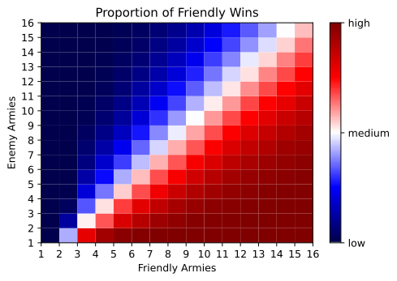

# risk

Bringing back this script I wrote in 2020 to analyse optimal strategies in the board game [Risk](https://en.wikipedia.org/wiki/Risk_(game)).

The script uses Monte Carlo Simulations to estimate the long run win rate of different combinations of armies.

## Usage

Please use 'requirements.txt' to install all necessary packages.

```shell
python risk.py

# or

python risk.py -n 1000
```

## Example



To better understand this result it's best to study the colour bar where, red = high proportion of friendly wins, white = medium proportion of friendly wins, dark blue = low proportion of friendly wins/high proportion of enemy wins. Using this to inspect the chart reveals that as we’d expect for extreme combinations such as 15 enemy armies against 1 friendly army, the winner will almost always be the army with the most overwhelming force. By extension, we can also observe that the curve forms a triangular shape for extreme combinations of enemy and friendly armies and an (almost) straight line down the middle for equal combinations such as 9 friendly and 9 enemy armies.

Interestingly, for low combinations of armies, such as 5 friendly armies against 3 enemy armies, the probability seems to skew towards a victorious friendly/attacking force. However, this could have also occurred by chance. Firstly, consider a combination of 1 friendly against 1 enemy army, since friendly armies must always have 1 army in any given territory that they hold, it would make sense that such an army can never win and is thus, dark blue. Also, you might notice for large combinations of armies, equal amounts of friendly and enemy armies are slightly skewed in favour of friendly forces which may be attributed to the fact that attacking forces can roll with a maximum of 3 dice.
